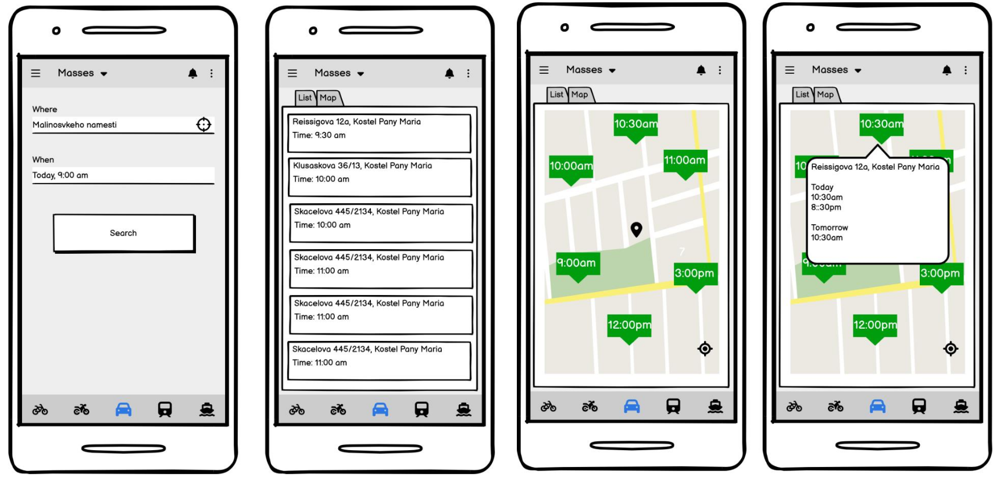

# ChurchMap EN
[CZ](#ChurchMap-CZ)
[EN](#ChurchMap-EN)

***Next mass is just a click away.***

## Team
- [Eliška](https://www.linkedin.com/in/eli%C5%A1ka-lutzov%C3%A1-9a3069251/)
- [Oliver](https://www.linkedin.com/in/oliver-hruban-002394227/)
- [Carlos](https://www.linkedin.com/in/carlosthe19916/)
- [Vojta](https://www.linkedin.com/in/vojtech-vlach/)

## Contents
- ChurchMap/ChurchMap - demo app using C# ASP.NET
- flask_demo - demo app using python flask + folium

## Problem
- People don’t know when the masses are.
- There is a website for Prague diocese [bohosluzby.apha.cz](https://bohosluzby.apha.cz/#;50.08312;14.41748;15;obec,%20%20kostel%20...;30), but the map is not responsible for mobile phones.
- This website is only for Prague archdiocese and nearby but is not available for other towns/places.

## We want
- Central database with all masses, churches, …
- Easy to access website address.

## Result
- Website with user interface showing data from the database – mobile first.
- Easy usable, accessible for Czech people and internationally
- Intuitive way of finding information about near mass soon

## What we did during heckaton
- Website that will show a map of masses in all Czech Republic and there will be information
- Filters – time, date (location)
- Mockups (see presentation)
- Map widget/website: implementation – Oliver con Carlos

## What can be done in the future:
- Mobile app
- Data
  - Download them from Prague website
  - Add our home towns
  - Database ER diagram - Vojta

## Outputs
- [Presentation](Church_Map_presentation.pdf) - la Eliškos
  - SWOT analysis  - el Carlos
  - Mockups - el Carlos
- Code – el Oliveros + el Vojtos

### ASP.NET demo

### Flask demo

### Mobile app mockups

### SWOT analysis

# ChurchMap CZ
[CZ](#ChurchMap-CZ)
[EN](#ChurchMap-EN)

***Přístí mše je na dosah kliku.***

## Tým
- [Eliška](https://www.linkedin.com/in/eli%C5%A1ka-lutzov%C3%A1-9a3069251/)
- [Oliver](https://www.linkedin.com/in/oliver-hruban-002394227/)
- [Carlos](https://www.linkedin.com/in/carlosthe19916/)
- [Vojta](https://www.linkedin.com/in/vojtech-vlach/)

## Obsah repozitáře
- ChurchMap/ChurchMap - demo aplikace v C# ASP.NET
- flask_demo - jednoduchá demo aplikace v python flask + folium

## Problem
- Kdy a kde jsou mše?
- Existuje webová stránka pro pražskou diecézi [bohosluzby.apha.cz](https://bohosluzby.apha.cz/#;50.08312;14.41748;15;obec,%20%20kostel%20...;30), ale mapa není responsivní pro mobily.
- Pouze pro pražskou diecézi a okolí, ale ne pro zbytek ČR.

## Co chceme
- Centralní databáze se všemi mšemi, kostely...
- Jednoduchá webová adresa

## Výsledek
- Webová stránka ukazující data z databáze - návrh primárně mobile first.
- Jednoduše použitelná, přístupná čechům i cizincům
- Intuitivní způsob nalezení informací

## Co jsme udělali během hekatonu
- Webovka ukazující mapu kostelů a mší
- Filtrování skrz datum, čas, (místo)
- Mockups - grafický návrh mobilní aplikace (viz prezentace)

## Co můžeme dělat v budoucnu
- mobilní aplikace
- Data
  - Využít existující data z pražské diecéze
  - Přidat naše domovská města
  - ER diagram databáze

## Výstupy
- [Prezentace](Church_Map_presentation.pdf) - la Eliškos
  - Swot analýza  - el Carlos
  - Mockupy - el Carlos
- Kód – el Oliveros + el Vojtos

### ASP.NET demo

### Flask demo

### Mobile app mockups

### SWOT analysis

